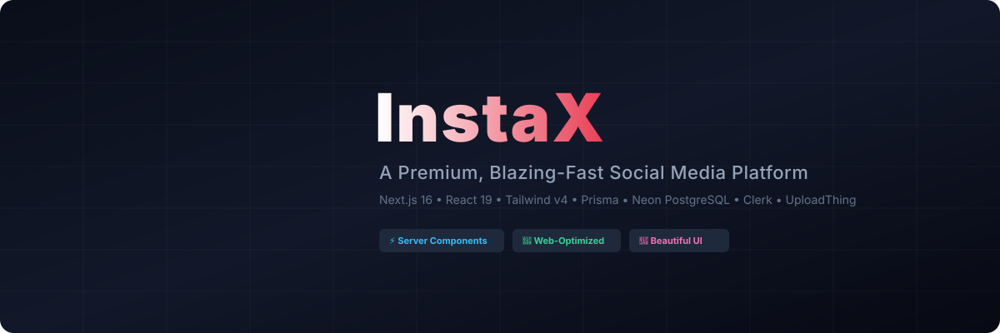
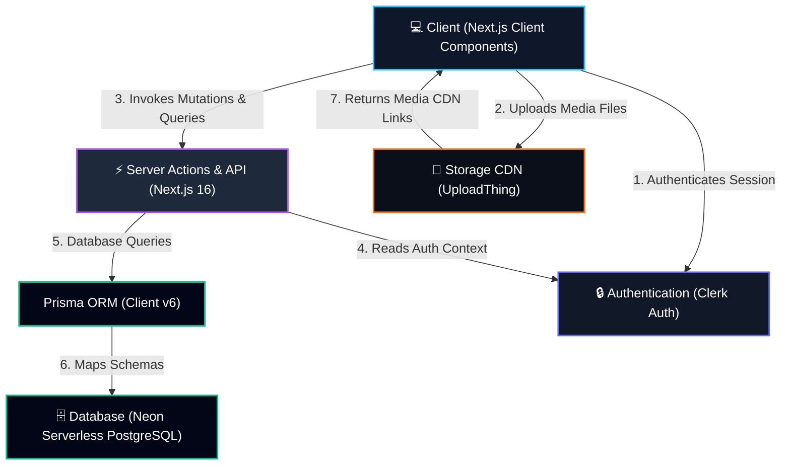

<div align="center">
  

  <p align="center">
    <strong>A premium, lightning-fast social media platform designed for visual and interactive excellence.</strong>
  </p>

  <p align="center">
    <a href="https://instax-g.vercel.app/"><strong>Explore the Live App »</strong></a>
  </p>

  <p align="center">
    
    
    
    
    
    
    
    
    
  </p>
</div>

---

## 📖 Table of Contents
1. [About InstaX](#-about-instax)
2. [Key Features](#-key-features)
3. [Architecture](#-architecture)
4. [Tech Stack](#-tech-stack)
5. [Performance Optimizations](#-performance-optimizations)
6. [Getting Started](#-getting-started)
7. [Environment Variables](#-environment-variables)
8. [Project Structure](#-project-structure)
9. [Roadmap](#-roadmap)
10. [Contributing](#-contributing)
11. [Author](#-author)

---

## 🌟 About InstaX

**InstaX** is a cutting-edge social media platform designed to deliver a modern, clutter-free user experience. Built with performance and visuals in mind, it provides a seamless space for posting, sharing media, following creators, liking posts, commenting, and tracking notifications. 

### Why it exists
Many social media clones are plagued with sluggish response times, database bottlenecks, unoptimized images causing layout shifts, and slow client-side waterfall fetches. InstaX solves these issues by combining Next.js 16's server architecture and React 19's concurrent features with lightweight server queries, ensuring pages load and update instantly.

### Who it is built for
- **Recruiters & Engineering Managers** looking for a production-grade demonstration of a Next.js 16 full-stack App Router codebase utilizing Server Actions, Prisma optimization, and responsive design.
- **Developers** seeking a modern template with clean separation of client-server boundaries, optimized image handling, and reliable third-party integrations (Clerk, UploadThing, Neon).

---

## 🎨 Key Features

| Feature | Description |
| :--- | :--- |
| 🔒 **Advanced Authentication** | Fully managed user lifecycle through Clerk Auth with secure signup, login, and Google OAuth integrations. |
| 📂 **Media Uploads** | Instant, high-speed image uploads up to 4MB backed by UploadThing's edge CDN. |
| 📝 **Post Creation** | Drag-and-drop image sharing coupled with text posts. Supports post deletion for owners. |
| 💬 **Comments & Likes** | Write thoughts on posts and toggle likes instantly with optimistic client updates. |
| 👥 **Social Connections** | Dynamic follow/unfollow system with automatic counters on profile cards. |
| 👤 **Profile Customization** | Update username (validated in real-time), edit display name, biography, website, and location. |
| 🔔 **Notification Hub** | Real-time notifications for likes, comments, and new followers, complete with instant server-side read status. |
| 🌓 **Dark Mode** | Full system-based and toggleable theme settings with glassmorphic layouts. |

---

## 🏗️ Architecture

The application is structured around a server-first, edge-optimized routing pipeline. Here is how components communicate:



---

## 💻 Tech Stack

### Frontend
- **Framework**: Next.js 16.2.6 (App Router, dynamic routing)
- **Library**: React 19.2.4 (React Server Components, Concurrent Features)
- **Language**: TypeScript
- **Styling**: Tailwind CSS v4.0 & Radix UI

### Backend & Database
- **API Architecture**: Next.js Server Actions (type-safe RPC endpoints)
- **Database ORM**: Prisma Client v6.19.3
- **Database Engine**: Neon Serverless PostgreSQL

### Services & Infrastructure
- **Authentication**: Clerk Core API (Session management & OAuth sync)
- **File Storage**: UploadThing (Edge CDN integration)
- **Hosting Platform**: Vercel

---

## 🚀 Performance Optimizations

InstaX is heavily optimized for fast load times and a lag-free feel:

- ⚛️ **Optimistic Updates**: Like-toggling updates UI counters instantly on the client before the server database confirmation finishes.
- ⚡ **No Client Waterfalls**: The `/notifications` and user `/profile` views are server-rendered (SSR), delivering complete markup to the client in a single request.
- 🖼️ **Image Optimization & Aspect Ratios**: Users' avatars are optimized through Clerk's image API using next/image with responsive sizes. Post images maintain native aspect ratios (preventing layout shift) and utilize edge lazy loading.
- 🗄️ **Prisma Database Indexes**:
  - `@@index([authorId, createdAt])` speeds up user-profile feed pagination.
  - `@@index([createdAt])` speeds up global home feed sorting.
  - `@@index([userId, postId])` speeds up double-like prevention checks.
- 🎯 **Parallel Data Fetching**: Operations like `toggleLike` fetch target posts and verify status in parallel using `Promise.all()` to minimize DB wait times.

---

## ⚙️ Getting Started

### Prerequisites
Make sure you have [Node.js](https://nodejs.org/) installed (v18.x or later recommended).

### 1. Clone the repository
```bash
git clone https://github.com/ggauravky/InstaX.git
cd InstaX
```

### 2. Install dependencies
```bash
npm install
```

### 3. Setup environment variables
Copy the `.env.example` file and fill in your keys:
```bash
cp .env.example .env
```
*(Refer to the [Environment Variables](#-environment-variables) section below to retrieve these values).*

### 4. Setup Prisma & Database schema
Sync the Prisma schema with your database (this creates indexes and tables):
```bash
npx prisma db push
```

### 5. Launch the development server
```bash
npm run dev
```
Open [http://localhost:3000](http://localhost:3000) in your browser to view the application.

---

## 🔑 Environment Variables

To run this project, you will need to add the following variables to your `.env` file:

| Variable | Description | Required | Source |
| :--- | :--- | :--- | :--- |
| `NEXT_PUBLIC_CLERK_PUBLISHABLE_KEY` | Public publishable key for Clerk client | Yes | [Clerk Dashboard](https://dashboard.clerk.com/) |
| `CLERK_SECRET_KEY` | Private secret key for Clerk backend | Yes | [Clerk Dashboard](https://dashboard.clerk.com/) |
| `DATABASE_URL` | Connection URI string for PostgreSQL database | Yes | [Neon Dashboard](https://console.neon.tech/) |
| `UPLOADTHING_TOKEN` | API Token for uploading files to UploadThing | Yes | [UploadThing Dashboard](https://uploadthing.com/) |

---

## 📁 Project Structure

```
InstaX/
├── prisma/
│   ├── schema.prisma      # Prisma schema models & indexes
├── public/
│   ├── avatar.png         # Default fallback avatar
│   ├── banner.svg         # README branding banner
│   ├── logo.svg           # Main SVG logo
│   └── social-preview.svg # OpenGraph preview banner
├── src/
│   ├── actions/           # Next.js Server Actions
│   │   ├── notification.action.ts
│   │   ├── post.action.ts
│   │   ├── profile.action.ts
│   │   └── user.action.ts
│   ├── app/               # App Router Pages & API routes
│   │   ├── api/           # API routes (uploadthing endpoints)
│   │   ├── notifications/ # Notifications SSR page & Client logic
│   │   ├── profile/       # Profile management and username routes
│   │   ├── layout.tsx
│   │   └── page.tsx       # Home Feed Page
│   ├── components/        # Shared UI and Layout components
│   │   ├── ui/            # Radix / shadcn core elements
│   │   ├── CreatePost.tsx
│   │   ├── PostCard.tsx
│   │   ├── WhoToFollow.tsx
│   │   └── sidebar.tsx
│   ├── hooks/             # Custom React Hooks
│   ├── lib/               # Shared libraries (prisma client, utils)
│   └── tsconfig.json      # TypeScript configurations
```

---

## 🗺️ Roadmap

- [x] **Clerk Auth Integration** (Google OAuth + Form Auth)
- [x] **UploadThing CDN Storage** (Image uploads up to 4MB)
- [x] **Likes & Comments system** (With optimistic UI rendering)
- [x] **Prisma PostgreSQL Indexes** (Speeding up queries & feeds)
- [x] **Username edit updates** (Real-time debounce validator)
- [x] **Vercel Production Build optimizations** (SSR & dynamic page compiling)
- [ ] **Direct Private Messaging** (Real-time chat channels)
- [ ] **Post Search & Hashtags** (Searching feed by tags or names)
- [ ] **Rich Text posts** (Markdown formatting within posts)

---

## 🤝 Contributing

Contributions are what make the open source community such an amazing place to learn, inspire, and create. Any contributions you make are **greatly appreciated**.

1. Fork the Project
2. Create your Feature Branch (`git checkout -b feature/AmazingFeature`)
3. Commit your Changes (`git commit -m 'Add some AmazingFeature'`)
4. Push to the Branch (`git push origin feature/AmazingFeature`)
5. Open a Pull Request

---

## 👤 Author

<div align="center">
  
  <h3>Gaurav Kumar Yadav</h3>
  <p>Full-Stack Web Developer &amp; Open Source Maintainer</p>

  <p>
    <a href="https://ggauravky.vercel.app/"><strong>Portfolio Website</strong></a> • 
    <a href="https://github.com/ggauravky"><strong>GitHub</strong></a> • 
    <a href="https://linkedin.com/in/gauravky"><strong>LinkedIn</strong></a> • 
    <a href="mailto:kumar.gaurav.yadav2007@gmail.com"><strong>Email Me</strong></a>
  </p>
</div>

---

<div align="center">
  <sub>Built with ❤️ using Next.js, React, Tailwind CSS, Prisma, Neon, and Clerk. Distributed under the MIT License.</sub>
</div>
